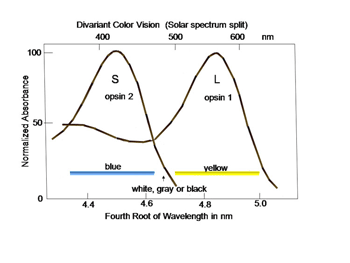

# 我们如何感知色彩

我们所认识的世界并非是这个世界全部的真相。以视觉为例，我们的眼睛大约能看到380nm到750nm之间的可见光。对于这个世界在其它电磁波段的景象，我们的肉眼是无法直接看见的。

非但如此，即便在我们可见的光谱范围，我们的认知也和真实世界有着不小的差距。我们都知道，我们的彩色视觉由可见光对三种视锥细胞的刺激产生。这三种视锥细胞分别对红光，绿光，和蓝光产生较大吸收，而对其它色光产生较小吸收。无论何种颜色的光线，三种视锥细胞都会受到不同程度的刺激。假设两束不同的光对这三种细胞的刺激相同，我们就会看到同样的颜色和亮度。以黄色为例，黄色光是介于光谱中红色光和绿色光之间的光线。存在单一波长的光线，看起来就是黄色。但是如果我们以适当的比例混合红色和绿色的光线，也能得到黄色的混合光线。这种光线由两种不同波长的光线组成，通过一个普通的三棱镜，就能把混合的黄光和单一波长的黄光区分开来，我们的眼睛却看不出这种区别。

我们之所以无法分辨单一波长的黄色光和红绿光混合所得到的黄光。仅仅是由于我们的感知器官，视网膜的限制。而和我们大脑的其余部分没有关系。我们对颜色的感觉取决于三种视锥细胞所受到的刺激的强度。如果我们控制色光的混合，使得混合光对三种视锥细胞的刺激强度与黄光产生的刺激强度相同，那么这种混合光在感知过程的开始就无法和黄光分辨，而被看成是黄色的光。

事实上在电子屏幕上我们就能观察到混合的黄光，常见的液晶显示屏是由一个个红，绿，蓝的子像素组成的。如果在一个区域内的蓝色子像素不发光，而红色和绿色子像素发光，那么这块区域在我们看来就是黄色的。就像下面这块区域。如果我们用一个放大镜去放大这块区域，我们就能看到发光的红色子像素与绿色子像素。

*虽然可能有点难以想像，但是我们在彩色电子屏幕上看到的黄色色块，实际上是由图中下面这些红色和绿色的子像素构成的。由于像素之间十分接近，我们的眼睛难以区分相邻的子像素，混合在一起看起来就成了黄色*

在很多地方，我们会看到三种视锥细胞的响应曲线。在视觉神经研究中，研究人员一般不把三种视锥细胞称为蓝色视锥细胞，绿色视锥细胞，和红色视锥细胞，而是按照三种视锥细胞的吸收波段分别称它们为S视锥细胞，M视锥细胞，和L视锥细胞。S、M、和L分别对应光波长为短（short）、中（middle）、和长（long），如下图所示。

> 
>
> [灵长目的视锥细胞光谱吸收曲线–WebVision, Color Vision](http://webvision.med.utah.edu/book/part-vii-color-vision/color-vision/)

如何使用响应曲线图呢？对于单色光，我们可以根据光的波长在图中读出三种视锥细胞的吸收值，和不同视锥细胞吸收值之间的比例。对每种波长的单色光，都有一定的吸收比例。由于光可强可弱。那么相同颜色的光，其吸收值之间的比例应该是近似的。从我们已知的常识来看，对于可见光波长范围内的不同波长的单色光，这个比例应该是不同的，否则我们就应该能够在光谱中观察到两段分离的同色区域，一种我们从未观察到的现象。我们也应当理解，不同波长的可见光看起来颜色不同，这个事实是和三种视锥细胞的吸收曲线的具体形式有关的。如果缺少了一种视锥细胞，或者视锥细胞的吸收曲线有两个峰，我们可能就没有办法分辨某些不同波长的单色光了。

如果我们要解读我们对特定波长光线的色彩感知，我们就需要像上图那样，在特定波长上读出三种视锥细胞的吸收值，再算出它们之间的比例。对于600nm波长的单色光，我们可以读出(S,M,L)=(0,0.5,1), 而这个光线的颜色是橙色。那么对于任何混合光线，只要对三种视锥细胞的吸收值满足0：0.5：1的关系，这种混合光线看起来就应该是橙色的。我们也可以在响应曲线图的各处读出这些比例，验证它们是否总不相同。

值得注意的是，L型视锥细胞在接近400nm的波长处其吸收率有变大的趋势，而在介于400nm和500nm之间，其吸收率其实是更小的。这种在短波长光线上上翘的曲线使我们能分辨出蓝色和紫色。如果S吸收较强，而L和M吸收率接近，那么我们看到的是蓝色，如果S吸收较强，但是L的吸收大于M的吸收，那么我们看到的是紫色。将蓝色光线和红色光线以适当比例混合，也能达到同样的吸收率比例。我们在紫色中看到的一抹红色，和L视锥细胞在短波长处的的第二响应段（Beta band）有关，这也是为什么蓝色光线和红色光线混合，得到的不是中间波长的绿色，而是最接近光谱短波端的紫色的原因。因为是不同类型的视锥细胞吸收率之间的比率，而不是混合光线的平均波长，直接决定了我们看到什么颜色。

我们的感知器官对外部世界刺激的响应决定了我们对这个世界的认识。这产生了一个有趣的现象，对外界刺激的响应和外界的刺激是两回事。我们能够看到色彩，这并不表示色彩就真实存在在外界的世界中。在自然界中存在的只有各种各样不同波长的电磁波，并不存在各种色彩的光。色彩是我们的心灵（mind）对外界刺激的响应。这种响应只能被一个单一的大脑所感知和理解。我不知道另一个人类看到650nm光线的时候是否和我存在同样的感觉，我只知道当我们同时看到这种光线的时候，我们都叫它红光。至于对方看到的红是不是我看到的那种红，我并不知晓。

有一个有趣的思想实验。假设一个人生来就戴上了一副电子眼镜。这副电子眼镜会将这人看到的一切光线分解成红绿蓝三原色，然后将红色替换成绿色，绿色替换成蓝色，蓝色替换成红色。当他/她看到一朵红色的玫瑰时，他/她一定会说：这是红色，虽然他/她实际看到的是绿色。那么当这人看到红玫瑰时，他/她心灵中的感觉是和其他人一样吗？假设有一天眼镜被拿走，他/她终于看到了世界的本来颜色，那么他/她看到红玫瑰时的感觉，和拿掉眼镜之前相比，哪个更接近其他人呢？

心灵的私有属性使得类似于这种问题很难获得解答。所谓心灵的私有属性是指我大脑中的种种活动只能由我感觉到。其他人虽然可以通过仪器来观察我大脑中的活动，但是这种观察和感觉到我的感觉有本质的区别。在现有的科技手段下，你无法去感觉另外一个人的心灵。所以诸如“对方看到的红是不是我看到的那种红？”这样的问题变得很难回答。

*戴上这副神奇的眼镜，她看到的世界就是上图的下半部分这样。是否有可能她感觉到的世界和我们并无二致呢？*

然而色彩的感觉并没有彻底向我们闭上大门。从前面的视锥光谱吸收曲线我们可以看到。L视锥细胞和M视锥细胞的曲线非常接近。这是因为哺乳动物在进化到灵长动物之前，只有两种视锥细胞。L视锥细胞在黄光处得到最大响应，S视锥细胞在蓝光处得到最大响应。灵长动物为了能够将红色的果实和绿色的叶子分辨开来，控制视锥细胞形成的基因发生了突变，原来的L变成了L和M，从而使得灵长动物能够看到三原色而不是原来的两原色。

>
>
>[WebVision,Color Vision](http://webvision.med.utah.edu/book/part-vii-color-vision/color-vision/)

*除了灵长动物以外，大多数哺乳动物只能看到两种颜色*

我曾经问过周围的人这样一组问题：

“你有没有觉得黄色里面有红色或者绿色的成分？”

“你有没有觉得青色里面有蓝色或者绿色的成分？”

“你有没有觉得紫色里面有红色或者蓝色的成分？”

我得到的答案都倾向于认为青色或者紫色是一种混合色，而黄色并不是红色和绿色混合而成。虽然这不是严谨的实验，但是我觉得L/M视锥细胞之间的关系不同于它们和S视锥细胞之间的关系。在灵长类动物之前的哺乳动物对黄色建立起来的神经模式，在灵长动物的大脑中也许依旧存在，这使得我们倾向于将黄色也看成一种原色。如果我的猜想是对的话，那么我就能通过这组问题来发现被问者是否从小就戴着这样一副神奇的电子眼镜了。如果被问的人说：“我觉得那个消防栓是红色和绿色混合的。”，那么他/她就是戴着电子眼镜长大的。

这给出了心灵研究的一种方法，虽然我们无法直接研究感觉，但是我们可以研究感觉之间的关系。这种关系本身也是一种感觉，我们称之为二阶感觉，也能被语言描述。如果所有这些一阶和二阶的感觉用语言描述出来都是一致的话，那么所有这些感觉很可能在不同人类之间是完全一致的。如果用语言描述出来有所不同，那么至少有一些（一阶的或二阶的）感觉在不同人类之间是不同的，如果我们有足够多的数据（语言的数据和生理学数据），那么也许我们就能发现这些不同到底在哪里。

*蓝黑还是白金？*

白金还是蓝黑？这张照片说明至少在一小部分可以用语言区分的情况下，人对颜色的感觉是不同的？那么又有多少无法用语言区分的色彩感觉，实际上是不同的？
